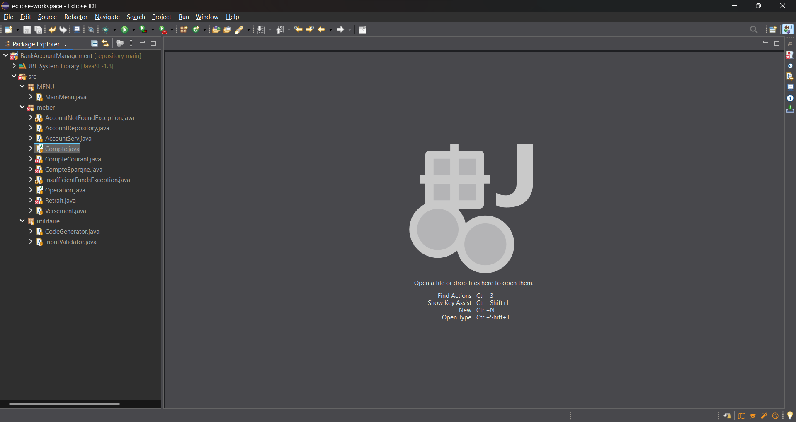
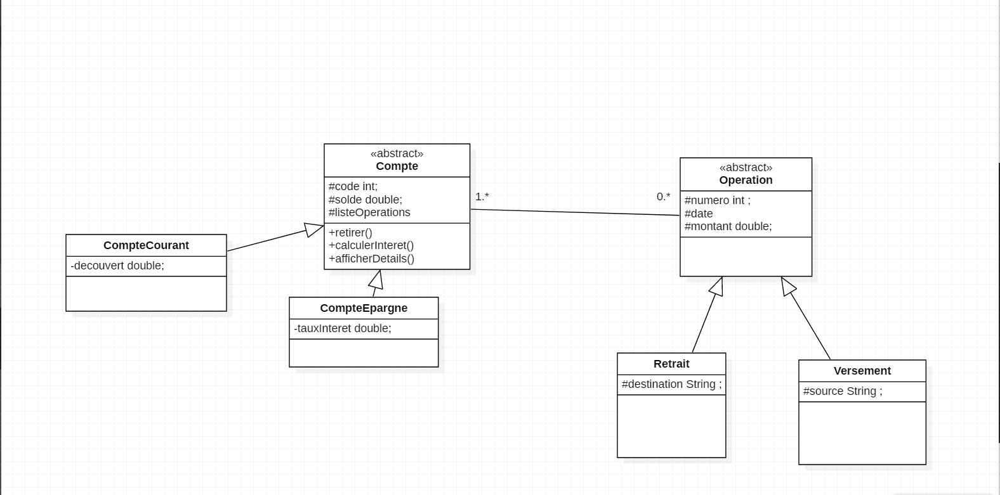

# README.md — Système de Gestion de Comptes Bancaires

---

## 1. Titre  
**Système de Gestion de Comptes Bancaires** — Application console Java 8

---

## 2. Description du projet  
Une banque souhaite automatiser la gestion de ses comptes via une application console en **Java 8**. L'application permet de créer des comptes (courant / épargne), d'effectuer des **versements**, **retraits** et **virements**, de consulter le solde et l'historique des opérations.  
L'architecture suit une **séparation en couches** : présentation (UI/menu), métier, utilitaire (et autres couches si nécessaire).

---

## 3. Fonctionnalités principales
- Création de compte courant ou compte épargne (format code : `CPT-12345`).
- Versement sur compte (enregistrer source).
- Retrait depuis compte (enregistrer destination).
- Virement entre comptes.
- Consultation du solde d'un compte.
- Liste des opérations d'un compte (avec date via Java Time API).
- Validation des entrées (montants positifs, format de code, etc.).
- Gestion des exceptions (try / catch).
- Données persistantes en mémoire pendant l'exécution.

**Bonus** (optionnel) :
- Utilisation de Stream API et lambdas.
- Persistance via MySQL + JDBC.
- Utilisation d’`Optional`.

---

## 4. Technologies utilisées
- Java 8 (obligatoire)  
- Collections Java : `ArrayList`, `HashMap`  
- Java Time API (`java.time`)  
- UUID (`java.util.UUID`) pour identifiants d'opérations  
- Outils : Eclipse (IDE), `javac`, `java`, Git  
- (Optionnel) MySQL + JDBC  

---

## 5. Structure du projet  
📸 **Capture d’écran de la structure réelle du projet ici**  



---

## 6. Prérequis
- JDK 8 installé et configuré (`java -version` doit renvoyer Java 1.8.x)  
- Eclipse (recommandé) ou tout autre IDE Java  
- Git (pour versioning)  
- (Optionnel) MySQL si vous activez la persistance  

---

## 7. Compilation & exécution (ligne de commande)
### Compiler
```
javac -d out src/**/*.java
```

### Générer le JAR exécutable
```
jar cfm bank-app.jar manifest.txt -C out .
```

### Exécuter
```
java -jar bank-app.jar
```

---

## 8. Diagramme de classes  
📸 **Capture d’écran du diagramme UML ici**  



---

## 9. Captures d’écran  
📸 Ajoutez des captures d’écran de l’application en exécution :  

- Menu principal  
- Création compte  
- Versement / Retrait / Virement  
- Liste des opérations  

Exemple :  
```


```

---


